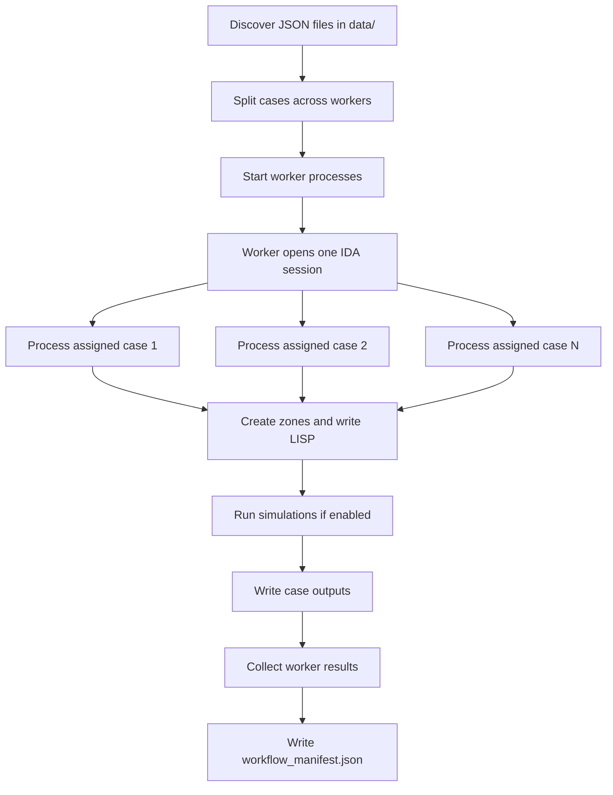

# Phase0 Orchestrator

This document explains the task and goals of the Phase0 orchestrator.

## Purpose

The orchestrator exists to run many Phase0 cases in parallel.

Each case starts from one input JSON file, creates the IDA zones, optionally runs simulations, and stores the outputs in a dedicated case folder.

The main goal is to reduce total execution time by using multiple workers instead of processing all cases one by one.

## Main Goal

Run simulations in parallel with different workers while keeping each case isolated and traceable.

## What the Orchestrator Does

1. Finds all matching JSON case files in `data/`.
2. Splits the cases across a configurable number of workers.
3. Starts one worker process per parallel slot.
4. Each worker opens its own IDA session.
5. Each worker processes several JSON cases sequentially in that same session.
6. For each case, the worker:
   - loads JSON + CSV reference data
   - creates zones
   - writes the generated LISP update script
   - saves the `.idm` model
   - optionally runs `HEATING`, `COOLING`, and `ENERGY`
   - stores outputs in the case folder
7. Collects success/failure results from all workers.
8. Writes a final `workflow_manifest.json`.

## Why Use Parallel Workers

The expensive part of the pipeline is opening IDA, creating the model, and running simulations.

Using multiple workers improves throughput because:

- different cases can run at the same time
- each worker keeps a persistent IDA session
- the session is reused for multiple assigned cases
- startup overhead is reduced compared with reconnecting for every single case

## Worker Model

The orchestrator uses a persistent-worker design.

- One worker process = one IDA session
- One worker can run multiple cases
- Cases are distributed in round-robin batches
- Workers run in parallel
- Cases inside one worker run sequentially

This gives a balance between:

- parallelism across workers
- stability inside each worker
- lower session startup cost

## Task Boundaries

The orchestrator is responsible for coordination, not geometry logic.

It does:

- case discovery
- worker scheduling
- worker logging
- retry on worker/case failure
- result collection
- manifest creation
- workspace/archive handling

It does not define:

- JSON schema design
- zone geometry formulas
- LISP template structure
- simulation postprocessing logic

Those are handled in other modules.

## Inputs

- Case JSON files in `data/`
- Reference CSV files used inside the workflow:
  - `data/zone_types.csv`
  - `data/zone_data.csv`
- Starting IDA model
- Runtime options:
  - `--json-pattern`
  - `--workers`
  - `--no-run-sims`
  - `--keep-prev-results`
  - `--discard-prev-results`
  - `--results-reader`

## Outputs

For each case, the orchestrator produces or coordinates:

- case folder in `work_ice/<case_name>/`
- saved model: `<case_name>.idm`
- generated LISP snapshot: `_scripts/<case_name>__update_script.txt`
- simulation outputs:
  - PRN files
  - PNG zone views
  - JSON summary reports
  - XLSX summary reports

For the full run:

- worker logs in `work_ice/_logs/`
- `workflow_manifest.json`
- optional archived run folder in `work_ice_archive/`

## Execution Flow

## Retry and Stability Goals

The orchestrator is designed to keep long runs stable.

Key protections:

- if a worker cannot connect to IDA, its assigned cases are marked failed
- if a case fails, the worker retries once
- on retry, the worker can disconnect, exit IDA, and reconnect
- worker logs are written to disk
- results are collected even if some cases fail

This is important because a parallel simulation run should not collapse just because one case or one worker fails.

## Why This Matters

Without the orchestrator, the workflow would be:

- slower
- harder to monitor
- harder to retry
- harder to scale to many input JSON cases

With the orchestrator, the project can move toward:

- batch execution
- web-triggered runs
- reproducible run manifests
- better use of available IDA licenses and machine time

## Main Files

- `run_phase0_and_ida_parallel.py`
  - CLI entrypoint for the full run
- `phase0/orchestrator.py`
  - parallel worker coordination
- `phase0/workflows.py`
  - per-case execution logic

## Recommended Reading Order

1. `run_phase0_and_ida_parallel.py`
2. `phase0/orchestrator.py`
3. `phase0/workflows.py`

## Short Summary

The orchestrator is the control layer of the pipeline.

Its job is to distribute many simulation cases across multiple workers, keep one IDA session per worker, run cases in parallel, collect outputs safely, and leave a complete record of the run.
