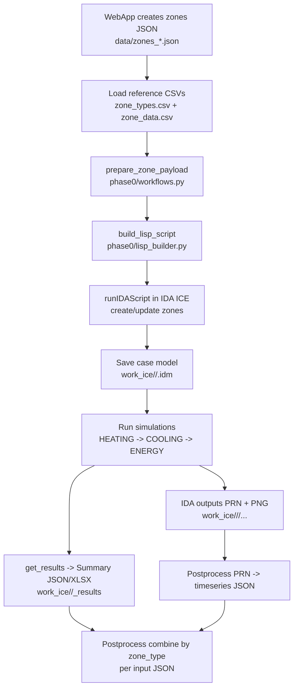
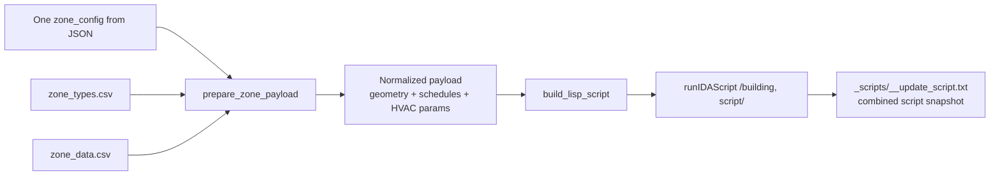
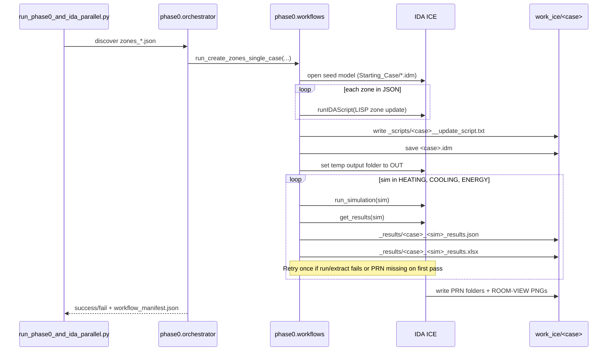
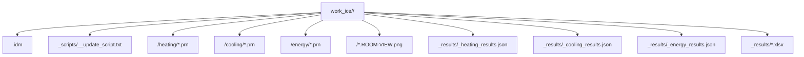
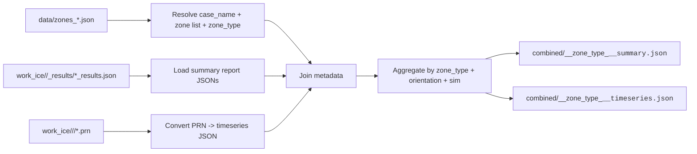

# Pipeline Input/Output and Critical Process

This document explains the end-to-end data flow from WebApp JSON inputs to IDA ICE execution outputs.

## Scope

- Input JSON files from the WebApp: `data/zones_*.json`
- Reference CSV files: `data/zone_types.csv`, `data/zone_data.csv`
- Zone script generation: `phase0/workflows.py` + `phase0/lisp_builder.py`
- IDA ICE simulations: `phase0/simulation.py`
- Stored outputs:
  - Time series: PRN (raw) and JSON (postprocessed)
  - Summary reports: JSON (and XLSX generated by pipeline)
  - Zone images: PNG

## High-Level Flow

## Execution Contexts

- CLI context: `run_phase0_and_ida_parallel.py` writes to `work_ice/`.
- WebAPI context: `webapi/server.py` writes per-job artifacts to `web_jobs/<job_id>/work_ice/` and packaged outputs to `web_jobs/<job_id>/outputs/`.
- The simulation core path is the same in both contexts (`phase0/workflows.py`).

## Input Contracts

### 1) WebApp JSON (`data/zones_*.json`)

Each file contains a list of zone configs (typically 5 orientations + internal-only for one room type):

- `zone_name`
- `zone_type` (code string, e.g. `"1"`, `"2"`)
- geometry: `room_length`, `room_width`, `room_height`
- envelope: `wwr`, `wall_constructions`, `ceiling_constructions`, `floor_constructions`, `surface_part`
- glazing/system params: `glazing_type`, `frame_area`, `frame_u_value`, etc.

### 2) CSV lookups

- `zone_types.csv`: `code -> description` used by schedule generation.
- `zone_data.csv`: `code -> occupants/lights/equipment/CAVsup/CAVret` used for internal gains and airflow parameters.

## JSON + CSV -> LISP Generation

Key implementation points:

- `prepare_zone_payload(...)` validates `zone_type` against CSV maps.
- `build_schedules(...)` resolves schedule names from zone type.
- `build_lisp_script(...)` assembles full `(:UPDATE ...)` blocks per zone.
- All per-zone scripts are concatenated and written to `_scripts/` for traceability.

### What `zone_type` extracts from the CSV files

The `zone_type` field in the input JSON is the key that links the JSON zone to both CSV reference tables.

From `zone_types.csv`:

- Lookup: `code -> description`
- Used to generate schedule and template names through `build_schedules(...)`
- Created schedule-related values:
  - `occ_schedule` -> `<code>. <description>_PersProfil`
  - `occ_type` -> `<code>. <description>_Std._Pers`
  - `light_schedule` -> `<code>. <description>_LichtProfil`
  - `light_type` -> `<code>. <description>_Std._Licht`
  - `equip_schedule` -> `<code>. <description>_GerateProfil`
  - `minvar_schedule` -> `MinVar_<description>`
  - `maxvar_schedule` -> `MaxVar_<description>`

From `zone_data.csv`:

- Lookup: `code -> occupants, lights, equipment, CAVsup, CAVret`
- Used to generate zone operational parameters
- Extracted zone-related numeric values:
  - `occupants`
  - `lights`
  - `equipment`
  - `CAVsup`
  - `CAVret`

### How that information is used in the LISP script

- Occupancy schedules and people type are inserted in the `INTERNAL-GAINS` block.
- Lighting schedules and lighting type are inserted in the `INTERNAL-GAINS` block.
- Equipment schedule is inserted in the `INTERNAL-GAINS` block.
- `minvar_schedule` and `maxvar_schedule` are inserted in the `INDOOR-CLIMATE` block as thermostat schedules.
- `CAVsup` and `CAVret` are inserted in the `ZONE-UNITS -> VENTILATION` block as `CAV-SUPPLY` and `CAV-RETURN`.

### Code references for this mapping

- `zone_type` -> schedules:
  - `phase0/geometry.py` -> `build_schedules(...)`
- `zone_type` -> numeric zone data:
  - `phase0/data_loader.py` -> `load_zone_data(...)`
- Combined into the final zone payload:
  - `phase0/workflows.py` -> `prepare_zone_payload(...)`
- Written into the final IDA update script:
  - `phase0/lisp_builder.py` -> `build_lisp_script(...)`

## Critical Process (Per JSON Input)

Critical controls in code:

- Worker-level retry after crash/reconnect (`phase0/orchestrator.py`).
- Simulation-level retry inside case execution (`phase0/workflows.py`).
- Output validation for JSON/XLSX and PRN presence.
- `ENERGY` summary extraction uses `ZONE-SUMMARY` only.

## Output Map

## Postprocess: Combine Results by Zone Type (Per Input JSON)

Goal: for each input JSON file (one room type scenario), combine outputs across its orientation zones into one consolidated dataset keyed by `zone_type` and simulation mode.

Recommended combined fields:

- `input_json`, `case_name`, `zone_type`, `zone_name`, `orientation`
- `simulation` (`heating|cooling|energy`)
- Summary metrics from `_results/*_results.json`
- Time series pointers or merged arrays from PRN-derived JSON
- Paths to exported PNG room views for the zone

## Suggested Postprocess Placement

- Run after `workflow_manifest.json` is produced.
- Iterate successful cases in manifest.
- For each case, use:
  - `_results/*.json` for summary metrics
  - `<case>/<sim>/*.prn` for time series conversion
  - `<case>/*.ROOM-VIEW.png` for visuals
- Write consolidated artifacts to `work_ice/combined/` or `work_ice_archive/.../combined/`.

## File References

- `run_phase0_and_ida_parallel.py`
- `phase0/orchestrator.py`
- `phase0/workflows.py`
- `phase0/data_loader.py`
- `phase0/lisp_builder.py`
- `phase0/simulation.py`
- `ida_suite_runner/results.py`
