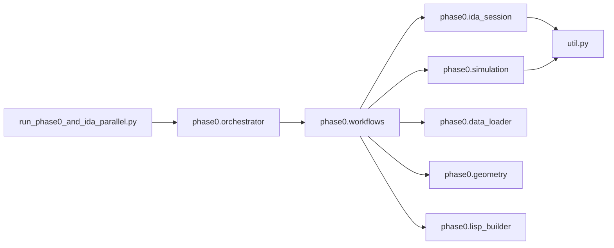
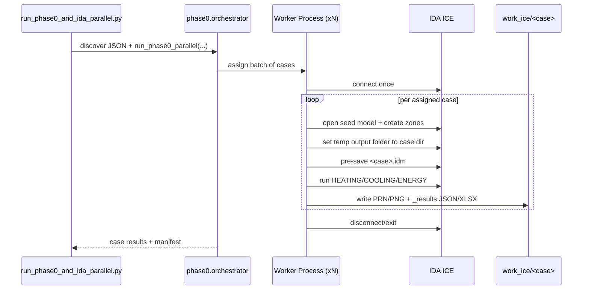
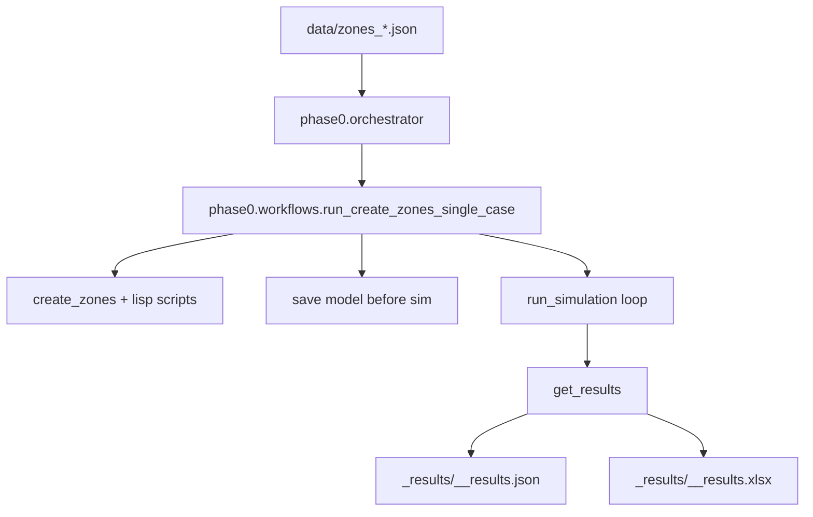

# VIKTOR Workflow Documentation

## Layout

```text
VIKTOR/
  data/                         # zone JSON inputs + reference CSVs
  Starting_Case/                # seed IDM models
  phase0/                       # model mutation + simulation + report export
  ida_suite_runner/             # legacy stage-2 runner/extractor utilities
  work_ice/                     # generated case outputs
  run_phase0_and_ida_parallel.py
  util.py                       # low-level IDA API bridge/bootstrap
```

## Package and Diagrams for Modules



### Main Modules

- `run_phase0_and_ida_parallel.py`: entrypoint, cleanup, case discovery, worker orchestration.
- `phase0/orchestrator.py`: persistent worker sessions (1 IDA process per worker), retry-once after crash.
- `phase0/workflows.py`: single-case lifecycle (create zones, save model, run sims, export results).
- `phase0/simulation.py`: run HEATING/COOLING/ENERGY and export `ZONE-SUMMARY` / `PEAK-SUMMARY` reports.
- `phase0/ida_session.py`: connect/open/save/disconnect wrappers.
- `util.py`: direct DLL bindings and queue-based API calls.

## Runtime Options

```powershell
python run_phase0_and_ida_parallel.py `
  --json-pattern "zones_*.json" `
  --workers 2 `
  --results-reader auto `
  --keep-prev-results
```

Supported flags:
- `--workers N`: number of parallel worker processes.
- `--results-reader auto|print|node`: report extraction strategy. THIS IS THE LIMITATION RIGHT NOW, VERY SLOW!!
- `--keep-prev-results` / `--discard-prev-results`: keep or clean `work_ice`.
- `--no-run-sims`: build cases only (skip simulations).

If `--workers` or keep/discard flags are omitted, CLI prompts are shown in interactive terminal mode.

## End-to-End Workflow



## Module Interaction



## Single Case Execution Lifecycle

1. Read one zones JSON and derive canonical case name (`Room_PHAERO_X`).
2. Open seed IDM.
3. Apply zone scripts.
4. Save `<case>.idm` before simulation.
5. Run simulation sequence: `HEATING -> COOLING -> ENERGY`.
6. Export report tables per simulation to JSON/XLSX.
7. Save model again and return result metadata.
8. If case fails/crashes in worker mode, retry once after reconnect.

## Work Directory Artifacts

Expected case layout:

```text
work_ice/
  Room_PHAERO_2/
    Room_PHAERO_2.idm
    Room_PHAERO_2/                # IDA temp output root (PRN/PNG/sim folders)
      heating/
      cooling/
      energy/
      Room_PHAERO_2_EAST.ROOM-VIEW.png
      ...
    _results/
      Room_PHAERO_2_heating_results.json
      Room_PHAERO_2_heating_results.xlsx
      Room_PHAERO_2_cooling_results.json
      Room_PHAERO_2_cooling_results.xlsx
      Room_PHAERO_2_energy_results.json
      Room_PHAERO_2_energy_results.xlsx
    _logs/
      worker_01.txt
      worker_02.txt
    _scripts/
      Room_PHAERO_2__update_script.txt
```

Notes:
- `ENERGY` export intentionally skips `PEAK-SUMMARY` and uses only `ZONE-SUMMARY`.
- Worker log files are verbose; terminal output is filtered to critical lines.
- Per-simulation intermediate `heating.idm`, `cooling.idm`, `energy.idm` are removed after successful flow.
- If you observe mixed folder names from earlier runs, rerun without `--keep-prev-results`.
