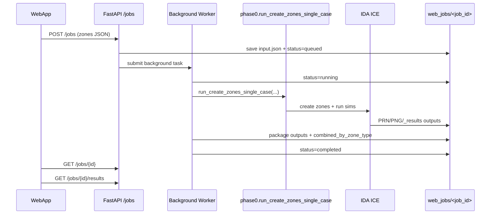

# WebApp Bridge Logic

This document explains the new backend bridge that connects your WebApp JSON input with the existing Phase0 + IDA workflow.

## What is NEW

- `webapi/server.py`: FastAPI server with 3 core endpoints.
- `webapi/__init__.py`
- `requirements.txt`: added `fastapi` and `uvicorn`.

No changes were made to the Phase0 simulation core.

## Simple Logic

1. WebApp sends zone JSON to `POST /jobs`.
2. API stores input in `web_jobs/<job_id>/input.json`.
3. API starts a background worker job.
4. Worker calls existing `run_create_zones_single_case(...)`.
5. After simulation, worker collects:
   - summary reports (`_results/*.json`)
   - PRN -> timeseries JSON
   - PNG room views
6. Worker builds combined results by `zone_type`.
7. WebApp polls status with `GET /jobs/{job_id}`.
8. WebApp fetches final payload from `GET /jobs/{job_id}/results`.

## Diagram



## Endpoints

- `GET /health`
- `POST /jobs`
- `GET /jobs/{job_id}`
- `GET /jobs/{job_id}/results`

### `POST /jobs` body

```json
{
  "zones": [
    {
      "zone_name": "Room_PHAERO_1_NORTH",
      "zone_type": "1"
    }
  ],
  "run_simulations": true,
  "results_reader": "auto"
}
```

Use your full current zone schema in `zones`; the snippet above is only minimal.

## Job Folder Layout

```text
web_jobs/
  <job_id>/
    input.json
    request.json
    status.json
    work_ice/
      <case_name>/
        <case_name>.idm
        <case_name>/... (PRN + PNG)
        _results/*.json
    outputs/
      result_bundle.json
      artifacts.zip
      summary_reports/*.json
      timeseries/*/*.json
      *.ROOM-VIEW.png
```

## How to Run

1. Install dependencies:
   - `pip install -r requirements.txt`
2. Start API:
   - `uvicorn webapi.server:app --host 0.0.0.0 --port 8000`
3. Connect WebApp to:
   - `POST http://<host>:8000/jobs`
   - `GET  http://<host>:8000/jobs/{job_id}`
   - `GET  http://<host>:8000/jobs/{job_id}/results`

## Important Notes

- `max_workers=1` is intentional in `JobManager` to avoid IDA session/license conflicts. (TESTING?)
- This is a first integration layer; security/auth and production hardening should be added before external deployment.

